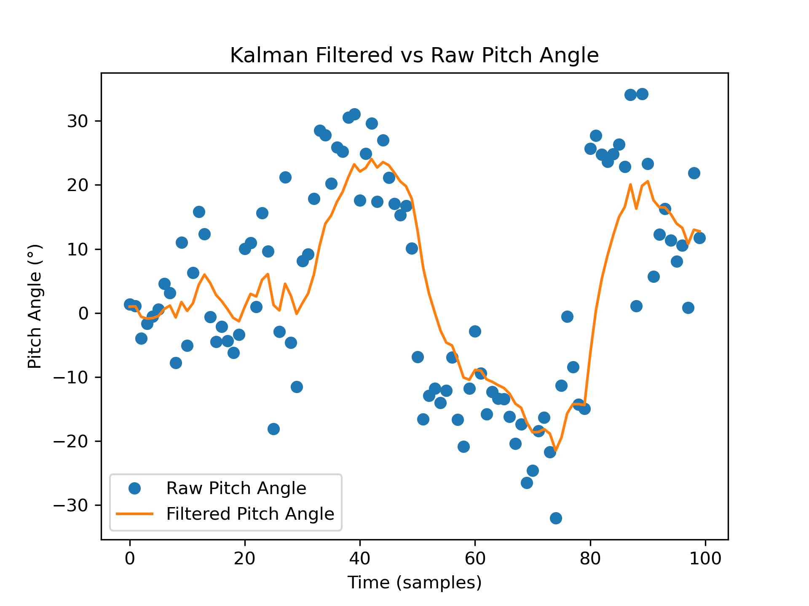

## asm330_imu_lkm Overview
asm330_imu_lkm is a linux kernel module for asm330lhh 6-DOF imu sensor driver. This project was built driven by the passion of learning how to write linux kernel module, as well as supporting my capstone project's imu on linux platform. The driver registers a spi device and an industrial io device on the host linux machine to provide real-time imu raw data reading.\
While the specific installation process may differ across various platforms, this README provides detailed instructions for correctly installing and utilizing the driver on Raspberry Pi 5. 

## Module Compilation and Install
1. First and foremost, before you build the kernel module, you must ensure the kmod package is installed. It essentially allows you to interact with the kernel module on your system.
```
# On Ubuntu/Debian GUN/Linux:
sudo apt-get install build-essential kmod
```
\
2. The second step before building, it is necessary to install the header files for the kernel.
```
# On Ubuntu/Debian GNU/Linux:
sudo apt-get update 
apt-cache search linux-headers-`uname -r`

# As the previous command prints the information on the available kernel header files.
# Then execute sudo apt-get install to install that kernel header
# example:
sudo apt-get install kmod linux-headers-6.11.0-1009-raspi
```
\
3. Build Kernel Module\
Execute the following command at the project direction. It should generate a kernel module object file `asm330_kmodule.ko` and a device tree overlay file `asm330_dt.dtbo`.
```
make
```
\
4. Apply Device Tree Overlay\
This step may require the user to modify the existing `asm330_dt.dts` device tree file to match the physical connection between the sensor and the Linux host board. The existing device tree overlay will work for the Raspberry Pi 5 platform.
```
sudo dtoverlay -d . asm330_dt.dtbo
```
\
5. Install Kernel Module\
Now, we are finally ready to install our built kernel module into the kernel. Here are the commands to make that happen.
```
# Since we are using industrialio, it needs to be activated
sudo modprobe industrialio

# Install the asm330 imu lkm
sudo insmod asm330_kmodule.ko

# Check if it's successfully installed
lsmod | grep asm330_kmodule
```
\
6. Fetch IMU data\
To see all the IMU raw data, you can checkout the iio device under `/sys/bus/iio/devices/iio:device0`.\
Example:
```
cd /sys/bus/iio/devices/iio:device0
watch -n 0.25 cat in_accel_x_raw in_accel_y_raw  in_accel_z_raw
```

## Kalman Filter 
Kalman filter in this module is currently implemented in the user space python program. Since the kernel is known to have difficulty to operate floating point operation, I decided to workaround the issue by reading IMU data from IIO device in python, and conduct the sensor fusion also in python. Kalman filter in kernel space will be on my TODO list.\

Here is a demonstration of Kalman filter generated pitch angle.\

